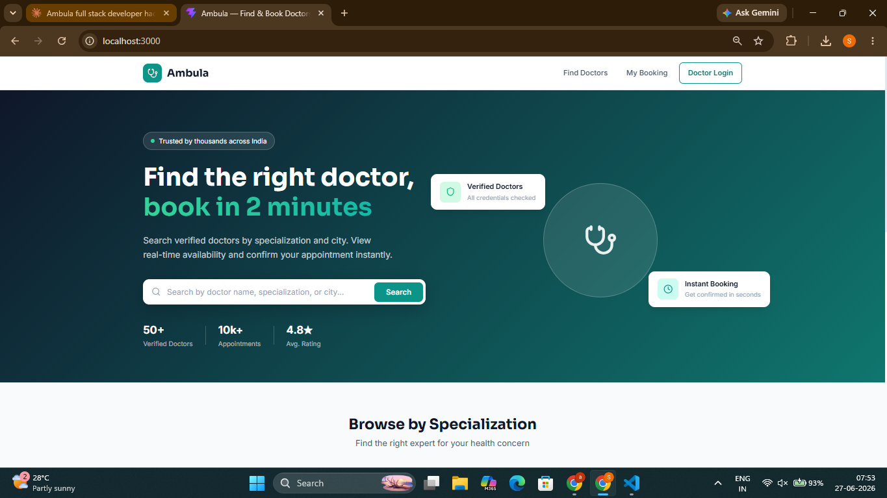
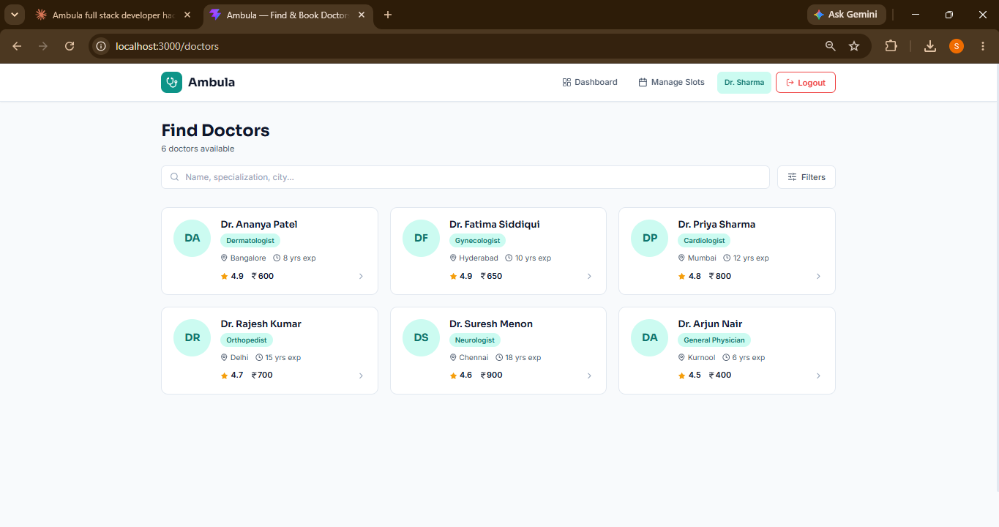
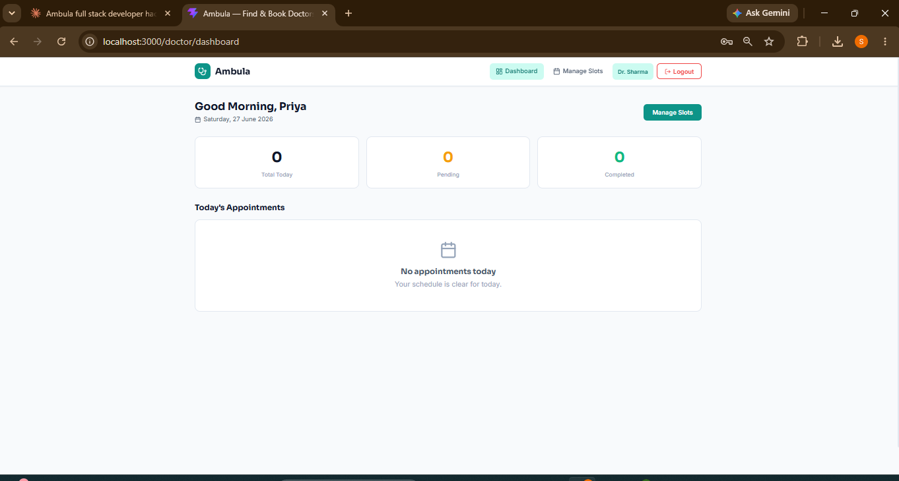
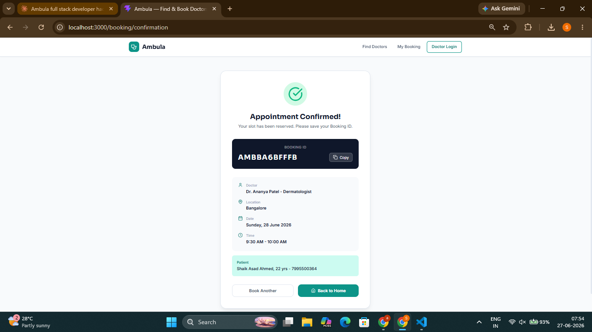
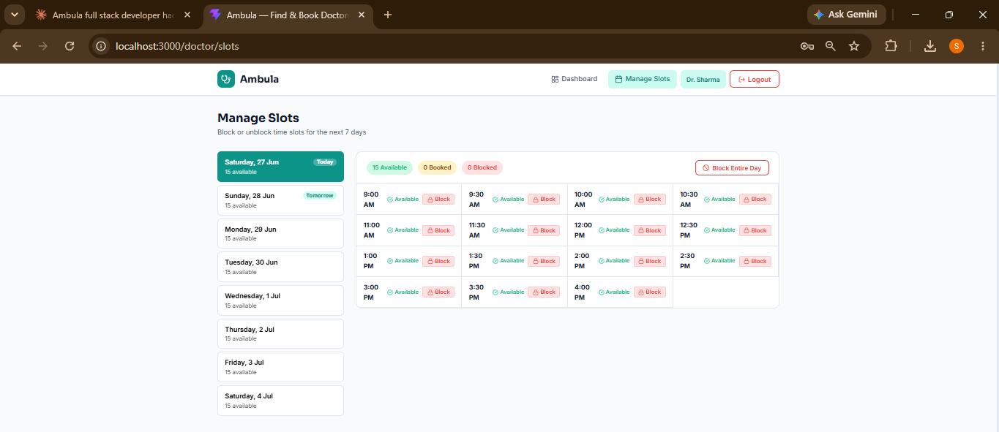
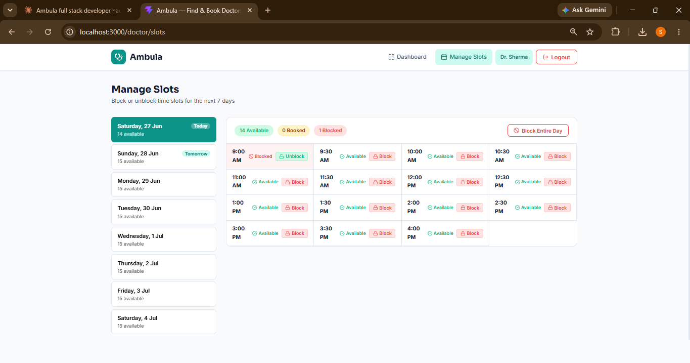

# Ambula '26 🏥

### Doctor Appointment Booking Platform

*Full-stack healthcare web platform where patients book appointments and doctors manage consultations — built for the Wooble × Ambula Technologies Hackathon 2026*


---

## Screenshots

<table>
  <tr>
    <td><br/><p align="center"><b>Home Page</b></p></td>
    <td><br/><p align="center"><b>Doctor Search</b></p></td>
  </tr>
  <tr>
    <td><br/><p align="center"><b>Doctor Profile & Slots</b></p></td>
    <td><br/><p align="center"><b>Booking Confirmation</b></p></td>
  </tr>
  <tr>
    <td><br/><p align="center"><b>Doctor Dashboard</b></p></td>
    <td><br/><p align="center"><b>Slot Management</b></p></td>
  </tr>
</table>

---

## The Problem

Millions of people in India still book doctor appointments via phone calls or WhatsApp. Doctors manage their schedules through paper registers. Patients carry physical files from one consultation to another. There is no single platform that handles booking, slot management, health summaries, and consultation notes reliably — especially under concurrent load.

---

## What Ambula Solves

**For Patients**
- Search doctors by specialization and city
- View real-time slot availability for next 7 days
- Book an appointment in under 2 minutes on mobile
- Get a unique Booking ID on confirmation
- Health summary (blood group, conditions, medications) shared with doctor

**For Doctors**
- Secure JWT login
- Today's appointments dashboard with patient health summary visible before consultation
- Add diagnosis notes and prescription after each visit
- Block individual slots or entire dates for leave
- Blocked slots never appear to patients

---

## Double-Booking Prevention

> Double-booking is prevented using **PostgreSQL row-level locking (`SELECT FOR UPDATE`) inside an atomic `book_slot` database function**, called via `supabase.rpc()`. When two concurrent booking requests arrive for the same slot, the database serializes them — the first transaction commits and marks the slot as `booked`, while the second reads the updated status and receives a `409` response with the next 3 available slots shown to the patient. This is enforced entirely at the database level, not the application level, making it reliable under any concurrency scenario.

---

## Tech Stack

| Layer | Technology |
|-------|-----------|
| Frontend | React 18 + Vite, React Router, Axios, Lucide Icons, React Hot Toast |
| Backend | Node.js + Express.js |
| Database | PostgreSQL via Supabase |
| Auth | JWT (jsonwebtoken + bcryptjs) |
| DB Client | @supabase/supabase-js (HTTPS — no port blocking) |
| Deployment | Railway (backend) + Vercel (frontend) |

---

## Project Structure

```
ambula/
├── backend/
│   ├── src/
│   │   ├── app.js
│   │   ├── db/
│   │   │   ├── supabase.js       Supabase client (HTTPS)
│   │   │   └── schema.sql        Full schema + seed + book_slot RPC
│   │   ├── middleware/
│   │   │   └── auth.js           JWT middleware
│   │   ├── controllers/
│   │   │   ├── doctorController.js
│   │   │   └── patientController.js
│   │   └── routes/
│   │       ├── doctors.js
│   │       └── patients.js
│   └── .env.example
└── frontend/
    └── src/
        ├── api/index.js
        ├── context/AuthContext.jsx
        ├── components/Navbar.jsx
        └── pages/
            ├── Home.jsx
            ├── DoctorList.jsx
            ├── DoctorProfile.jsx
            ├── BookingConfirmation.jsx
            ├── BookingLookup.jsx
            ├── DoctorLogin.jsx
            ├── DoctorDashboard.jsx
            └── DoctorSlots.jsx
```

---

## Setup Instructions

### 1. Supabase Database
- Go to Supabase → SQL Editor
- Paste full contents of `backend/src/db/schema.sql` → Run

### 2. Backend
```bash
cd backend
npm install
cp .env.example .env
# Fill in your values
npm run dev
```

**backend/.env**
```
PORT=5000
SUPABASE_URL=https://your-project.supabase.co
SUPABASE_SERVICE_ROLE_KEY=your_service_role_key
JWT_SECRET=your_jwt_secret
JWT_EXPIRES_IN=7d
NODE_ENV=development
FRONTEND_URL=http://localhost:3000
```

Get `SUPABASE_SERVICE_ROLE_KEY` from: Supabase Dashboard → Project Settings → API → `service_role`

### 3. Frontend
```bash
cd frontend
npm install
npm run dev
```

---

## Test Credentials

Password for all doctors: **`doctor123`**

| Doctor | Email | Specialization |
|--------|-------|---------------|
| Dr. Priya Sharma | priya.sharma@ambula.in | Cardiologist |
| Dr. Rajesh Kumar | rajesh.kumar@ambula.in | Orthopedist |
| Dr. Ananya Patel | ananya.patel@ambula.in | Dermatologist |
| Dr. Suresh Menon | suresh.menon@ambula.in | Neurologist |
| Dr. Fatima Siddiqui | fatima.siddiqui@ambula.in | Gynecologist |
| Dr. Arjun Nair | arjun.nair@ambula.in | General Physician |

---

## API Endpoints

### Patient (Public)
```
GET  /api/patients/doctors              Search/list doctors
GET  /api/patients/doctors/:id          Doctor profile + available slots
POST /api/patients/book                 Book slot (atomic double-booking prevention)
GET  /api/patients/booking/:code        Lookup booking by code
```

### Doctor (JWT Required)
```
POST  /api/doctors/login                Login
GET   /api/doctors/today-appointments   Today's schedule
POST  /api/doctors/consultation/:id     Save diagnosis + prescription
GET   /api/doctors/slots                All upcoming slots
PATCH /api/doctors/slots/:id/block      Toggle slot block
PATCH /api/doctors/slots/block-date     Block entire date
```

---

## Deployment

### Backend → Railway
1. Push to GitHub
2. Railway → New Project → Deploy from GitHub → select `backend` as root directory
3. Add all environment variables
4. Auto-deploys on push

### Frontend → Vercel
1. Vercel → Import repo → set `frontend` as root directory
2. Add env: `VITE_API_URL=https://your-railway-url.up.railway.app/api`
3. Deploy

---

## Submission Notes

**Feature intentionally left out:** Real-time SMS/email notifications — would require Twilio/SendGrid integration. Deprioritized to keep infrastructure lean. First feature in v2.

**One improvement with more time:** WebSocket-based real-time slot updates via Socket.io — so patients see slots disappear live across all browser tabs as bookings happen, closing the tiny race window between UI fetch and booking attempt.
```

